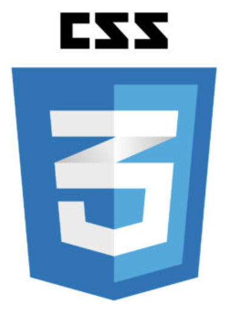
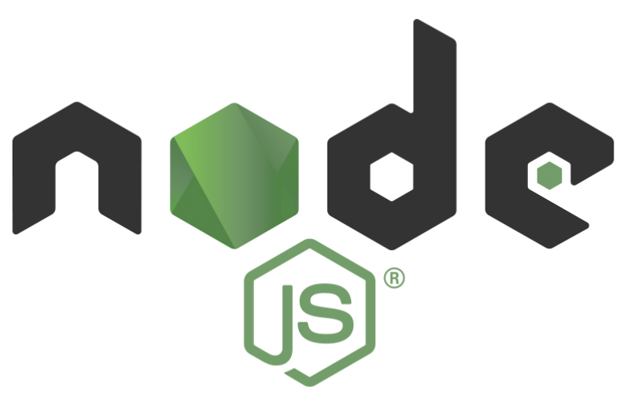
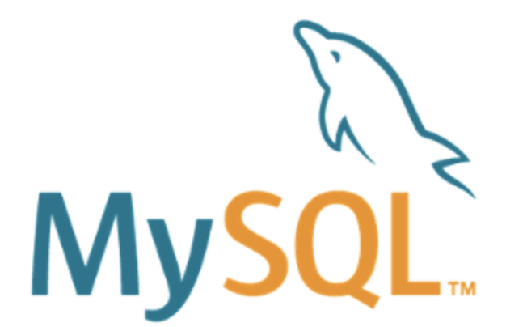

# *QR  ATTENDANCE CHECK*
## 프로젝트 소개
코로나로 인해 실내 활동 시 명부작성이 의무화됨에 따라 효율적으로 명단을 관리하기 위해 큐알코드를 활용한 출석체크 프로그램을 개발하였습니다. 
 
## 사용 기술
### 1. Front-end

||||
|:---: |:---: |:---:|
|HTML|CSS|JS|

### 2. Back-end
||||
|:---:|:--:|:--:|
|Node.js|MySQL|socket|

## 주요 기능
### <사용자모드>
#### 1. 큐알코드에 출석체크 웹사이트 url 삽입
- 큐알코드 스캔 시 해당 URL로 이동
#### 2. 최초 출석체크 시 본인 또래, 이름 쿠키값으로 저장
- 사용자가 직접 등록하는 방식
#### 3. 저장된 쿠키값을 통해 출석체크 진행
- 큐알코드 스캔하여 출석체크 URL로 이동하면 자동으로 출석체크 진행
### <관리자모드>
#### 1. 사용자의 출석상태 확인/변경/삭제 가능
#### 2. 출석 날짜 추가/삭제 기능
#### 3. 사용자 정보 추가/수정/삭제 기능
#### 4. 사용자의 출석 정보 엑셀 파일로 변환하는 기능

## 미리보기 
### 1. 사용자모드 페이지

 

- 사용자모드 아이콘
> 쿠키 아이콘 : 쿠키값에 저장된 사용자정보 삭제  
> 사람 아이콘 : 관리자모드로 전환하는 아이콘   

### 2. 관리자모드 페이지

### 3. 큐알코드 페이지

## 출석체크 과정

### 1. 큐알코드 스캔

### 2. 사용자정보 등록 후 출석체크 진행

### 3. 출석완료

### 4. 큐알코드 페이지에서 출석완료 메시지 출력

